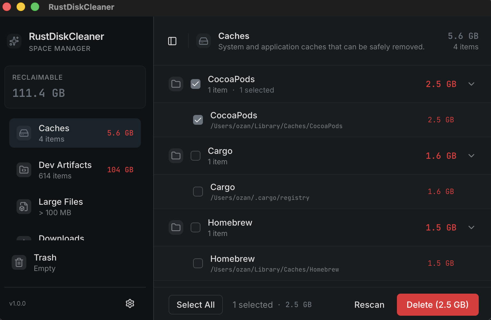

# RustDiskCleaner

[](https://www.rust-lang.org/)
[](https://tauri.app/)
[](https://react.dev/)
[](https://www.typescriptlang.org/)
[](https://opensource.org/licenses/MIT)

A fast disk space analyzer and cleaner for macOS, built with Tauri, React, and Rust.



## Table of Contents

- [Features](#features)
- [Installation](#installation)
  - [Homebrew (Recommended)](#homebrew-recommended)
  - [Manual Download](#manual-download)
- [Development](#development)
- [Tech Stack](#tech-stack)
- [License](#license)

## Features

- Scans directories for large files and caches
- Categorizes files (caches, logs, downloads, node_modules, etc.)
- Move files to trash with easy restoration
- Multiple color themes (dark and light variants)
- Native macOS performance with Rust backend

## Installation

### Homebrew (Recommended)

```bash
brew tap ozankasikci/rust-disk-cleaner
brew install --cask rust-disk-cleaner
```

To update to the latest version:

```bash
brew upgrade --cask rust-disk-cleaner
```

### Manual Download

1. Download the latest `.dmg` file from the [Releases](https://github.com/ozankasikci/rust-disk-cleaner/releases) page
2. Open the DMG file
3. Drag `RustDiskCleaner.app` to your Applications folder
4. Launch from Applications or Spotlight

> **Note**: On first launch, you may need to right-click the app and select "Open" to bypass Gatekeeper, as the app is not notarized.

## Development

```bash
# Install dependencies
npm install

# Run in development mode
npm run tauri dev

# Build for production
npm run tauri build

# Run tests
npm test                    # Frontend tests
cd src-tauri && cargo test  # Backend tests
```

## Tech Stack

- **Frontend**: React, TypeScript, Tailwind CSS, shadcn/ui
- **Backend**: Rust, Tauri v2
- **Build**: Vite

## License

MIT
